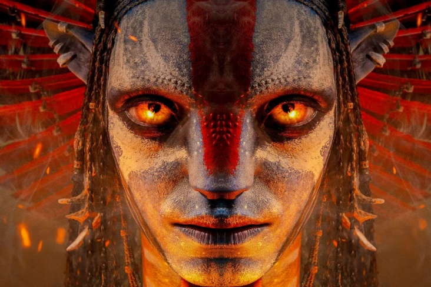

# Приветствие

Добрый день!!!

# Фотография

## Описание

Я занимаюсь бездействием и интересуюсь современными технологиями, люблю батлифилд 2042.

### Области интересов
- Веб-разработка
- Системное программирование
- Профильно занимаюсь баттлфилдом на протяжении 3-х лет, стаж внушительный, считаю себя достаточно неплохим кандидатом на подобные должности

### Языки программирования
- **Знаю:** HTML, CSS, JavaScript
- **Изучаю:** Python, SQL, Java и плюсики++
- **Хочу изучить:** Английский и в дуолинго игру в шахматы.

# Контакты
- Telegram: извините, не дам
- Email: vanea.bolgari@gmail.com
- GitHub: https://github.com/Deta03